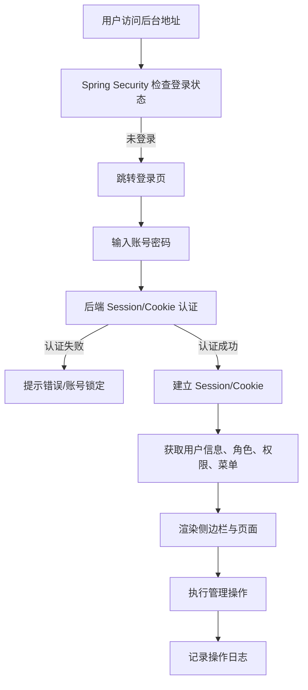

# Molly 后台管理系统 - 产品需求文档

## 1. 产品概述

Molly 后台管理系统是一个基于 RBAC（基于角色的访问控制）模型的管理后台，用于支撑后端服务的用户、角色、权限与审计日志管理。

- 面向系统管理员与运营人员，提供安全的登录认证与细粒度权限控制。
- 采用服务端托管静态页面架构，页面由后端直接提供，后端负责业务逻辑与数据持久化。

## 2. 核心功能

### 2.1 用户角色

| 角色 | 获取方式 | 核心权限 |
|---|---|---|
| 超级管理员（admin） | 系统初始化生成 | 拥有全部权限，不可删除 |
| 普通管理员 | 由超级管理员创建并分配角色 | 根据角色拥有对应菜单、按钮与接口权限 |

### 2.2 功能模块

1. **登录认证**：账号密码登录、Session/Cookie 管理、登出。
2. **首页 Dashboard**：展示系统概览与快捷入口。
3. **系统管理 - 用户管理**：用户的增删改查、启用禁用、分配角色。
4. **系统管理 - 角色管理**：角色的增删改查、分配权限。
5. **系统管理 - 权限管理**：权限树维护，支持目录、菜单、按钮、接口四种类型。
6. **系统管理 - 日志管理**：登录日志与操作日志查询。

### 2.3 页面详情

| 页面名称 | 所属模块 | 功能描述 |
|---|---|---|
| 登录页 | 认证 | 账号密码输入、表单校验、登录失败/锁定提示 |
| 首页 | Dashboard | 系统概览卡片、快捷入口 |
| 用户管理 | 系统管理 | 用户列表、新增/编辑弹窗、分配角色、启用禁用、逻辑删除 |
| 角色管理 | 系统管理 | 角色列表、新增/编辑、分配权限树 |
| 权限管理 | 系统管理 | 权限树表格、新增/编辑目录菜单按钮接口 |
| 登录日志 | 系统管理 | 登录/登出记录查询 |
| 操作日志 | 系统管理 | 管理操作记录查询 |

## 3. 核心流程

用户首次访问系统时进入登录页，输入账号密码后后端进行 Session/Cookie 认证；认证成功后建立 Session/Cookie，浏览器保存 Cookie 并拉取用户信息、角色、权限与菜单；之后用户根据权限访问对应页面与按钮，所有管理操作与查询均被记录到操作日志。

## 4. 用户界面设计

### 4.1 设计风格

- **主色调**：以深蓝（`#1e3a8a`）为品牌色，白色与浅灰（`#f3f4f6`）为背景，橙红（`#ef4444`）为危险操作强调色。
- **布局**：经典后台布局，左侧固定侧边栏，顶部 Header，右侧内容区。
- **组件风格**：采用 Bootstrap 5 与 jQuery 插件（DataTables、jsTree、flatpickr），按钮与表单遵循 Bootstrap 样式，表格行高 `48px`。
- **字体**：系统默认无衬线字体，标题加粗，正文常规，保持清晰可读。
- **动效**：页面切换使用淡入淡出，菜单展开收起使用平滑高度过渡，操作成功后给出 Message 提示。

### 4.2 页面设计概述

| 页面名称 | 关键 UI 元素 |
|---|---|
| 登录页 | 居中卡片、Logo、账号/密码输入框、登录按钮、错误提示 |
| 首页 | 统计卡片、快捷入口列表 |
| 用户管理 | 查询表单、数据表格、分页、新增/编辑弹窗、角色选择器 |
| 角色管理 | 表格、权限分配抽屉/弹窗（树形选择） |
| 权限管理 | 树形表格、新增/编辑弹窗、类型选择 |
| 日志管理 | 日期筛选、操作类型筛选、分页表格 |

### 4.3 响应式

- 桌面优先，最小适配宽度 `1280px`。
- 侧边栏在窄屏下可收起，内容区自动适配剩余宽度。

