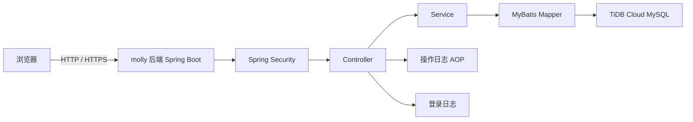
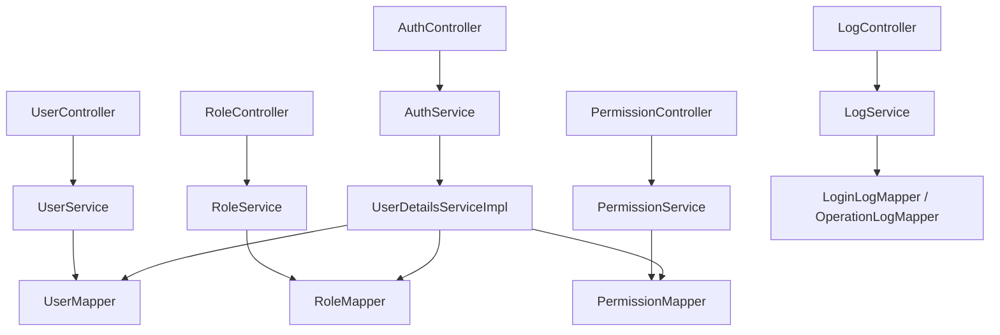
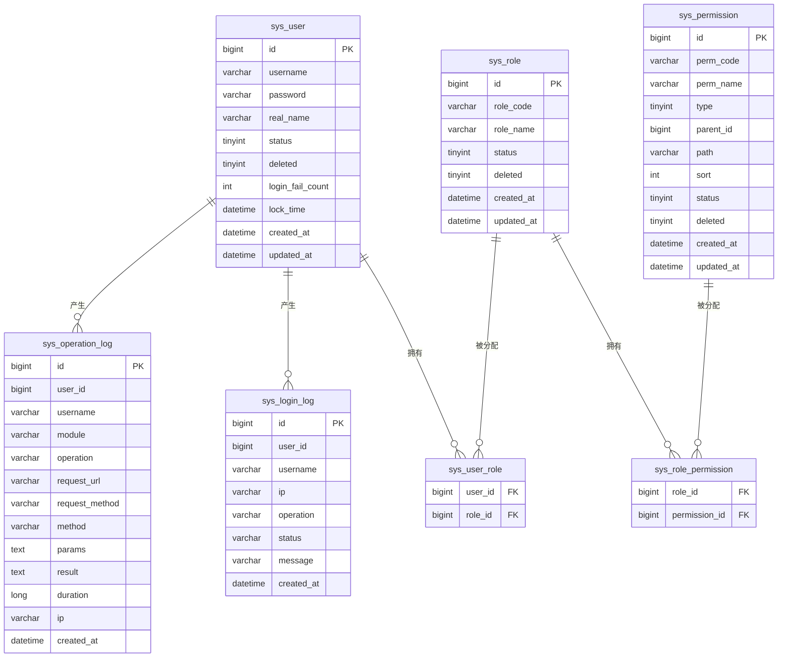

# Molly 后台管理系统 - 技术架构文档

## 1. 架构设计



## 2. 技术说明

- **前端**：jQuery + Bootstrap 5 + DataTables + jsTree + flatpickr（CDN），静态页面位于 `src/main/resources/static/`，由 Spring Boot 直接托管
- **后端**：Spring Boot 3.2.7 + Spring Security + MyBatis + MySQL/TiDB
- **认证**：Spring Security Session/Cookie 登录
- **权限模型**：RBAC，用户 -> 角色 -> 权限
- **数据库**：TiDB Cloud MySQL 兼容实例
- **部署**：Spring Boot 内置容器直接运行，静态资源由后端托管

## 3. 页面路径

| 页面 | 路径 |
|---|---|
| 登录页 | `/login.html` |
| 首页 Dashboard | `/dashboard.html` |
| 用户管理 | `/users.html` |
| 角色管理 | `/roles.html` |
| 权限管理 | `/permissions.html` |
| 登录日志 | `/login-logs.html` |
| 操作日志 | `/operation-logs.html` |

## 4. API 定义

### 4.1 认证相关

```ts
interface LoginRequest {
  username: string
  password: string
}

interface LoginResponse {
  code: number
  message: string
}

interface UserInfo {
  id: number
  username: string
  realName: string
  roles: string[]
  permissions: string[]
  menus: Menu[]
}

interface Menu {
  id: number
  name: string
  path: string
  type: number // 1 目录 2 菜单
  children?: Menu[]
}
```

### 4.2 统一响应

```ts
interface Result<T> {
  code: number
  message: string
  data: T
}

interface PageResult<T> {
  list: T[]
  total: number
  pageNum: number
  pageSize: number
}
```

## 5. 后端架构



## 6. 数据模型

### 6.1 ER 图



### 6.2 数据定义

建表语句与初始化数据由 Flyway 迁移脚本 `src/main/resources/db/migration/V1__init_schema.sql` 与 `V2__init_data.sql` 提供。

