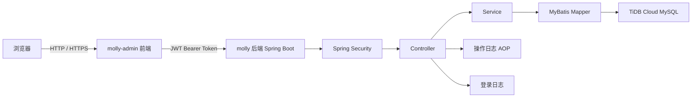
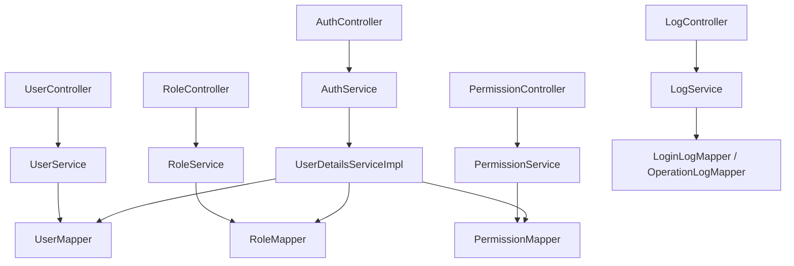
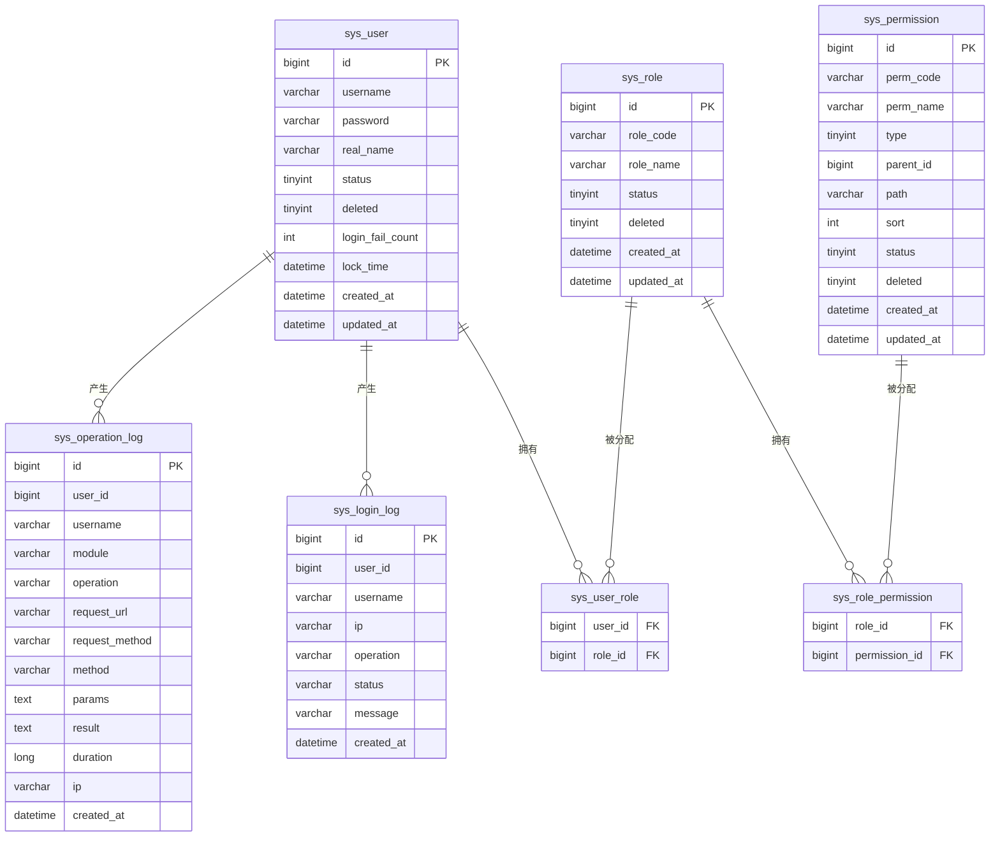

# Molly 后台管理系统 - 技术架构文档

## 1. 架构设计



## 2. 技术说明

- **前端**：Vue 3 + TypeScript + Vite + Element Plus + Vue Router 4 + Pinia + Axios
- **后端**：Spring Boot 4.0.7 + Spring Security + MyBatis + MySQL/TiDB
- **认证**：JWT 单 Token，有效期 24 小时
- **权限模型**：RBAC，用户 -> 角色 -> 权限
- **数据库**：TiDB Cloud MySQL 兼容实例
- **部署**：前端静态资源由 Nginx 托管，反向代理 `/api` 到后端服务

## 3. 路由定义

| 路由 | 用途 |
|---|---|
| `/login` | 登录页 |
| `/` | 主布局，重定向到首页 |
| `/dashboard` | 首页 Dashboard |
| `/system/user` | 用户管理 |
| `/system/role` | 角色管理 |
| `/system/permission` | 权限管理 |
| `/system/login-log` | 登录日志 |
| `/system/operation-log` | 操作日志 |
| `/403` | 无权限提示页 |
| `/*` | 404 页面 |

## 4. API 定义

### 4.1 认证相关

```ts
interface LoginRequest {
  username: string
  password: string
}

interface LoginResponse {
  token: string
  tokenType: string
  expiresIn: number
}

interface UserInfo {
  id: number
  username: string
  realName: string
  roles: string[]
  permissions: string[]
  menus: Menu[]
}

interface Menu {
  id: number
  name: string
  path: string
  type: number // 1 目录 2 菜单
  children?: Menu[]
}
```

### 4.2 统一响应

```ts
interface Result<T> {
  code: number
  message: string
  data: T
}

interface PageResult<T> {
  list: T[]
  total: number
  pageNum: number
  pageSize: number
}
```

## 5. 后端架构



## 6. 数据模型

### 6.1 ER 图



### 6.2 数据定义

建表语句与初始化数据由后端 `src/main/resources/schema.sql` 与 `data.sql` 提供，`admin` 账号由 `SystemInitRunner` 在应用启动时生成。

