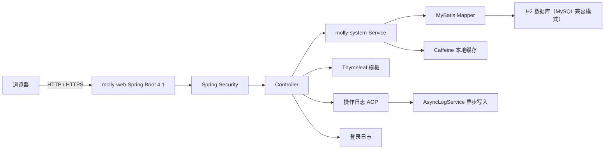
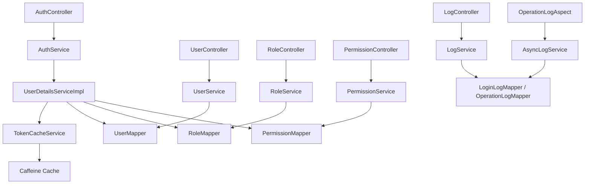
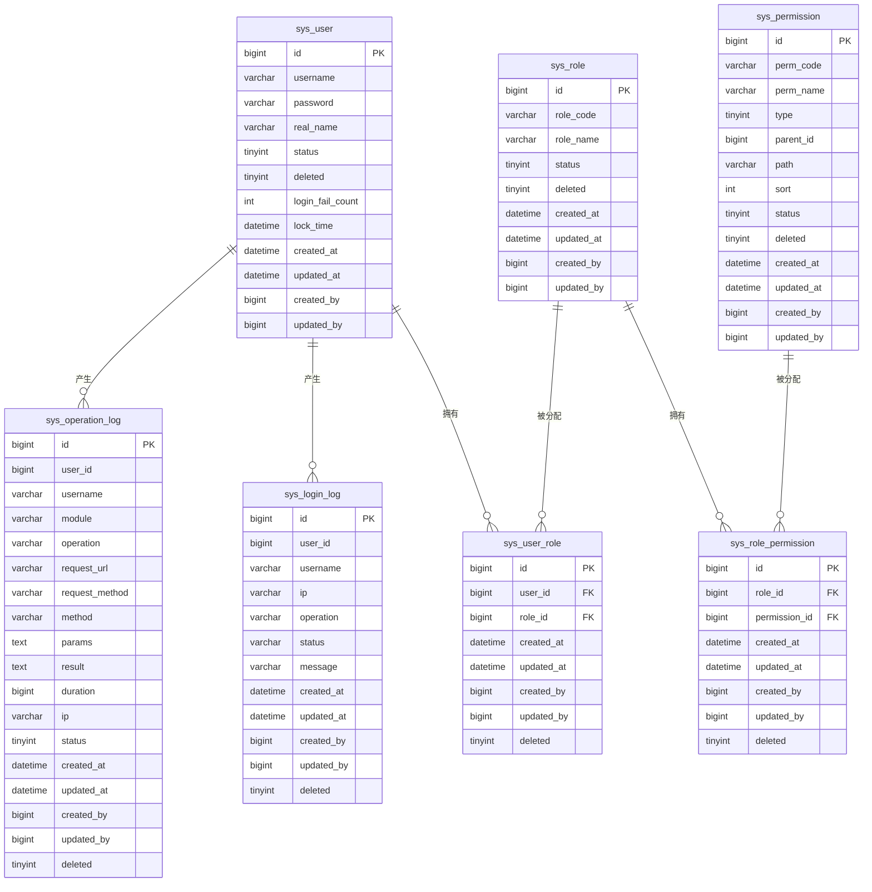

# Molly 后台管理系统 - 技术架构文档

## 1. 架构设计



## 2. 模块划分

| 模块 | 路径 | 职责 |
|---|---|---|
| molly-common | `molly-common/` | 通用 DTO、VO、工具类、异常与常量 |
| molly-system | `molly-system/` | 实体、Mapper、Service、业务逻辑与数据访问 |
| molly-web | `molly-web/` | Controller、Security 配置、Thymeleaf 模板、静态资源与应用入口 |

模块依赖关系：`molly-web` → `molly-system` → `molly-common`。

## 3. 技术说明

- **前端**：Thymeleaf 模板位于 `molly-web/src/main/resources/templates/`，由 Spring Boot 直接渲染。jQuery、Bootstrap 5、AdminLTE、DataTables、jsTree、flatpickr 通过 WebJars 引入；Bootstrap Icons 通过 CDN 引入。
- **后端**：Spring Boot 4.1.0 + Spring Security 6.x + MyBatis 4.1.0 + PageHelper 4.1.1 + Flyway + H2（MySQL 兼容模式）
- **认证**：Spring Security Session/Cookie 登录，Session 有效期 30 分钟；支持 Remember-Me（7 天），令牌持久化到 `sys_persistent_logins`。
- **缓存**：Spring Cache + Caffeine 本地缓存，用于用户角色与权限。
- **权限模型**：RBAC，用户 -> 角色 -> 权限。
- **数据库**：H2（MySQL 兼容模式），开发环境使用文件持久化，测试环境使用独立内存库，生产环境使用文件持久化。
- **部署**：Spring Boot 内置容器直接运行，页面由后端渲染。

## 4. 页面路径

| 页面 | 路径 |
|---|---|
| 登录页 | `/login` |
| 首页 Dashboard | `/` 或 `/dashboard` |
| 用户管理 | `/users` |
| 角色管理 | `/roles` |
| 权限管理 | `/permissions` |
| 登录日志 | `/login-logs` |
| 操作日志 | `/operation-logs` |

## 5. API 定义

### 5.1 认证相关

```ts
interface LoginRequest {
  username: string
  password: string
}

interface LoginResponse {
  code: number
  message: string
  data: UserInfo
}

interface UserInfo {
  user: {
    id: number
    username: string
    realName: string
    status: number
  }
  roles: string[]
  permissions: string[]
  menus: Menu[]
}

interface Menu {
  id: number
  name: string
  path: string
  type: number // 1 目录 2 菜单
  permCode: string
  children?: Menu[]
}
```

### 5.2 统一响应

```ts
interface Result<T> {
  code: number
  message: string
  data: T
}

interface PageResult<T> {
  list: T[]
  total: number
  pageNum: number
  pageSize: number
}
```

## 6. 后端架构



## 7. 数据模型

### 7.1 ER 图



### 7.2 数据定义

建表语句与初始化数据由 `molly-system/src/main/resources/db/migration/` 下的 Flyway 脚本管理，应用启动时自动执行并按版本顺序迁移。

| 脚本 | 说明 |
|---|---|
| V1__init_schema.sql | 初始化表结构 |
| V2__init_data.sql | 初始化基础数据 |
| V3__update_permission_codes.sql | 权限编码调整 |
| V4__update_menu_paths.sql | 菜单路径调整 |
| V5__add_persistent_logins.sql | 增加 Remember-Me 持久化表 |
| V6__add_dict_and_config.sql | 增加字典与配置表 |

- **开发环境**：H2 文件库（`./data/molly-dev`），数据持久化到项目目录
- **测试环境**：H2 内存库（`molly-test`），每次测试独立初始化
- **生产环境**：H2 文件库（`./data/molly-prod`）

### 7.3 关键字段说明

- `status`：启用/禁用状态，`1` 启用，`0` 禁用。
- `deleted`：逻辑删除标志，`0` 正常，`1` 已删除。
- `login_fail_count` / `lock_time`：连续登录失败次数与锁定时间，失败 5 次后锁定 30 分钟。
- `type`（sys_permission）：`1` 目录、`2` 菜单、`3` 按钮、`4` 接口。

## 8. 认证与授权

- 登录页面为 `/login`，表单提交到 `/login`，成功后建立 Spring Security Session，Cookie 名称为 `SESSION`，启用 `HttpOnly` 与 `SameSite=Strict`。
- 登出接口为 `POST /api/auth/logout`，清除 SecurityContext、Session 与 Remember-Me 令牌，并删除 `SESSION`、`XSRF-TOKEN`、`remember-me` Cookie。
- 用户角色与权限在登录时加载并缓存到 Caffeine；权限编码直接作为 Authority 使用（如 `user:view`、`loginLog:view`）。
- 页面访问通过 `@PreAuthorize("hasAuthority('xxx:view')")` 控制，接口操作通过对应 Authority 控制。
- CSRF 启用，但 `/api/**` 路径除外；CSRF Token 通过 Cookie 与请求头传递。
- 响应头包含 Content-Security-Policy 与 X-Frame-Options 安全配置。

## 9. 日志

- **登录日志**：在 `AuthService` 中同步写入，记录登录/登出、成功/失败、IP、消息等信息。
- **操作日志**：通过 `OperationLogAspect` 拦截带 `@OperationLog` 注解的方法，调用 `AsyncLogService` 异步写入 `sys_operation_log`。
