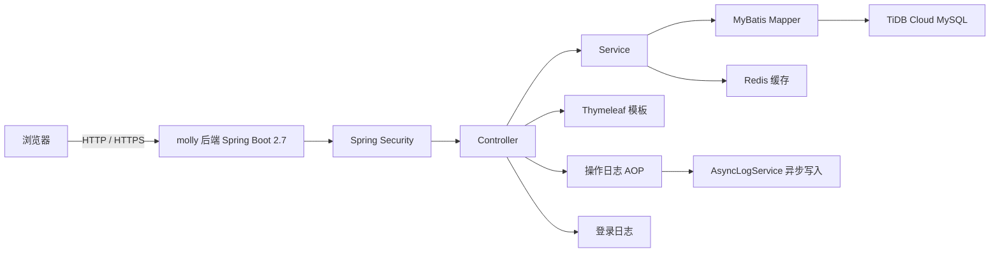
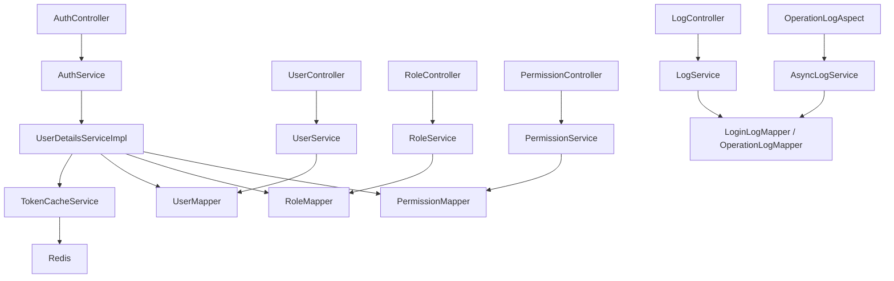
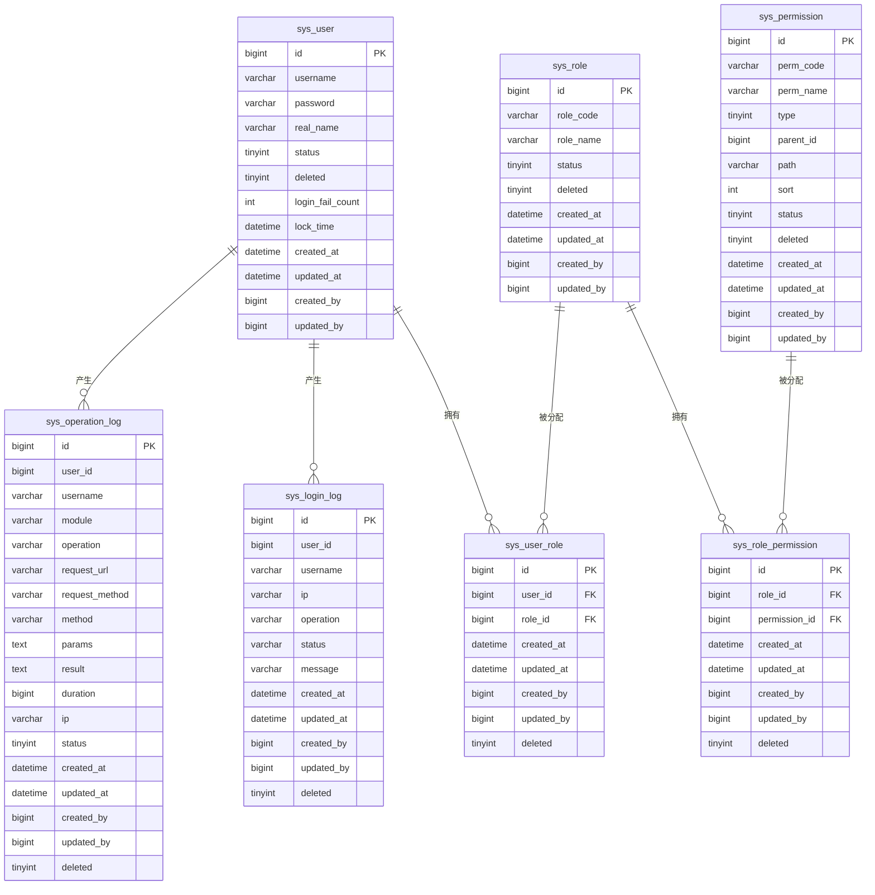

# Molly 后台管理系统 - 技术架构文档

## 1. 架构设计



## 2. 技术说明

- **前端**：jQuery + Bootstrap 5 + DataTables + jsTree + flatpickr（CDN），Thymeleaf 模板位于 `src/main/resources/templates/`，由 Spring Boot 直接渲染并托管静态资源
- **后端**：Spring Boot 2.7.18 + Spring Security + MyBatis + MySQL/TiDB
- **认证**：Spring Security Session/Cookie 登录，Session 有效期 30 分钟
- **缓存**：Spring Data Redis（默认 Upstash Redis，SSL 连接），缓存用户角色与权限
- **权限模型**：RBAC，用户 -> 角色 -> 权限
- **数据库**：TiDB Cloud MySQL 兼容实例
- **部署**：Spring Boot 内置容器直接运行，页面由后端渲染

## 3. 页面路径

| 页面 | 路径 |
|---|---|
| 登录页 | `/login` |
| 首页 Dashboard | `/` 或 `/dashboard` |
| 用户管理 | `/users` |
| 角色管理 | `/roles` |
| 权限管理 | `/permissions` |
| 登录日志 | `/login-logs` |
| 操作日志 | `/operation-logs` |

## 4. API 定义

### 4.1 认证相关

```ts
interface LoginRequest {
  username: string
  password: string
}

interface LoginResponse {
  code: number
  message: string
  data: UserInfo
}

interface UserInfo {
  user: {
    id: number
    username: string
    realName: string
    status: number
  }
  roles: string[]
  permissions: string[]
  menus: Menu[]
}

interface Menu {
  id: number
  name: string
  path: string
  type: number // 1 目录 2 菜单
  permCode: string
  children?: Menu[]
}
```

### 4.2 统一响应

```ts
interface Result<T> {
  code: number
  message: string
  data: T
}

interface PageResult<T> {
  list: T[]
  total: number
  pageNum: number
  pageSize: number
}
```

## 5. 后端架构



## 6. 数据模型

### 6.1 ER 图



### 6.2 数据定义

建表语句与初始化数据由项目根目录下的 `sql/init_schema.sql` 与 `sql/init_data.sql` 提供，需要手动导入数据库。

### 6.3 关键字段说明

- `status`：启用/禁用状态，`1` 启用，`0` 禁用。
- `deleted`：逻辑删除标志，`0` 正常，`1` 已删除。
- `login_fail_count` / `lock_time`：连续登录失败次数与锁定时间，失败 5 次后锁定 30 分钟。
- `type`（sys_permission）：`1` 目录、`2` 菜单、`3` 按钮、`4` 接口。

## 7. 认证与授权

- 登录接口为 `POST /api/auth/login`，成功后建立 Spring Security Session，Cookie 名称为 `SESSION`，启用 `HttpOnly` 与 `SameSite=Strict`。
- 登出时清除 SecurityContext 并清空 Redis 中的用户角色/权限缓存。
- 用户角色与权限在登录时加载并缓存到 Redis；权限编码存储为 `system:user:view` 等形式，实际鉴权时会转换为 `user:view`、`loginLog:view`、`operationLog:view` 等 Authority。
- 页面访问通过 `@PreAuthorize("hasAuthority('xxx:view')")` 控制，接口操作通过对应 Authority 控制。

## 8. 日志

- **登录日志**：在 `AuthService` 中同步写入，记录登录/登出、成功/失败、IP、消息等信息。
- **操作日志**：通过 `OperationLogAspect` 拦截带 `@OperationLog` 注解的方法，调用 `AsyncLogService` 异步写入 `sys_operation_log`，避免影响主业务响应时间。
